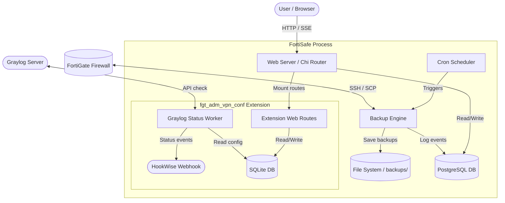

# FortiSafe

<p align="center">
  
</p>

<p align="center">
  <strong>Secure, scheduled, self-contained backups for FortiGate firewalls.</strong>
</p>

<p align="center">
  <a href="https://golang.org"></a>
  <a href="https://github.com/arumes31/fortigate-scp-backup/actions/workflows/ci.yml"></a>
  <a href="https://github.com/arumes31/fortigate-scp-backup/pkgs/container/fortigate-scp-backup"></a>
  <a href="LICENSE"></a>
</p>

---

## 📖 Overview

**FortiSafe** is a web-based management tool and automation engine that backs up FortiGate firewall configurations securely over SSH/SCP. It compiles into a **single, fully static binary** that runs the web interface, the backup scheduler, and every extension's background worker as concurrent goroutines in one process — no external task queue, application server, or sidecar required.

Point it at your firewalls, set a schedule, and FortiSafe pulls each configuration on a cron/interval basis, stores it (optionally encrypted at rest), keeps a configurable number of copies, and emails you when a run fails.

### Highlights
* **Single-process model** — the web server, cron scheduler, and extension workers all run as lightweight goroutines inside one binary.
* **Fully static & lightweight** — ships as a distroless container holding only the compiled binary and root CA certificates.
* **No CGO required** — pure-Go drivers (e.g. `modernc.org/sqlite` for extensions) keep cross-compilation and container builds clean.
* **Configured entirely by environment** — every setting is an environment variable; there are no config files to template.
* **Same-origin by default** — the UI, styles, and self-hosted fonts are served from the app itself under a strict Content-Security-Policy; no external CDNs are contacted at runtime.

---

## 🏗️ Process Architecture



---

## ✨ Features

- 🛡️ **Firewall Management**: Register and monitor multiple firewalls, each with its own credentials, SSH port, retention count, and backup schedule. Add them individually or in bulk via CSV.
- ⏰ **Automated Scheduling**: Cron or interval-based backups, with staggered runs on startup to avoid traffic spikes. Trigger any backup on demand and test connectivity from the UI.
- 🔐 **Hardened Security**:
  - **AES-256-GCM at rest**: Optional encryption for every stored backup and firewall SSH password.
  - **Local passwords hashed with bcrypt**, plus a forced password change on first login.
  - **Session guard**: Signed sessions, idle timeouts, and X-Forwarded-For pinning.
  - **Multi-factor auth**: Optional TOTP and RADIUS (PAP). The login screen surfaces a mobile-approval hint and allows up to 60 s for push/MFA prompts.
  - **Brute-force lockout**: Per-IP + username rate limiting with a configurable lockout window.
- 🔎 **Configuration Search**: Full-text, wildcard search across the newest saved configuration of every firewall, with a built-in library of example queries (hostnames, policies, VPN, admin/security review, and more).
- 📊 **Dashboard & Activity Log**: At-a-glance health summary, failing-firewall shortlist, and an audited activity trail with optional age-based pruning.
- 📡 **Real-time Updates**: Live status propagation to the UI via Server-Sent Events (SSE).
- 🔍 **Security Auditing & Insights**:
  - **Shadow Rule Finder**: Identifies firewall policies shadowed or blocked by preceding rules.
  - **Weak Crypto Policy Flags**: Scans IPsec VPN configurations for weak encryption/integrity settings (DES, 3DES, MD5, weak DH groups) and global outdated TLS settings.
  - **Security Fabric Audit**: Flags missing Fortinet Security Fabric (CSF) setups.
  - **CVE Correlation & Upgrade Paths**: Maps the detected FortiOS version to known critical CVEs (e.g. CVE-2023-27997, CVE-2024-21762) and outlines safe upgrade paths.
  - **Compliance Scoring**: Dynamically calculates scores for PCI-DSS, CIS Benchmarks, and HIPAA.
  - **Change Tickets & Exemptions**: Link configuration runs to change tickets, and log approved security exemptions.
- 🗺️ **Network Topology Visualizer**: Renders interactive, CDN-free SVG maps detailing:
  - Physical ports & VLAN sub-interfaces branching off physical ports.
  - Managed FortiSwitches, their ports, and their assigned VLANs.
  - Static routing destinations and gateways.
  - Firewall zone-to-zone policies.
- ✉️ **SMTP Alerts**: Failure notifications with STARTTLS enforced (plaintext delivery is refused).
- 🔌 **Modular Extension System**: A clean loader mounts self-contained extensions (such as the FGT ADM VPN configuration module) with their own routes, storage, and background workers.
- 🖥️ **Terminal-style Web UI**: A full-width, keyboard-accessible interface with a self-hosted monospace typeface — no external fonts or scripts.

---

## 📋 Prerequisites

1. **FortiGate SSH & SCP Access** — enable SCP backups on the target FortiGate:
   ```txt
   config system global
       set admin-scp enable
   end
   ```
2. **SCP User Account & Profile** — create a dedicated profile and administrator with read access to the system configuration:
   ```txt
   config system accprofile
       edit "scp-profile"
           set comments "Access profile for FortiSafe backups"
           set secfabgrp read
           set ftviewgrp read
           set authgrp read
           set sysgrp custom
           set netgrp read
           set loggrp read
           set fwgrp read
           set vpngrp read
           set utmgrp read
           set wifi read
           set cli-diagnose enable
           set cli-get enable
           set cli-show enable
           set cli-exec enable
           set cli-config enable
           config sysgrp-permission
               set admin read-write
               set upd read
               set cfg read
               set mnt read
           end
       next
   end

   config system admin
       edit "scpuser"
           set accprofile "scp-profile"
           set password <YOUR_SECURE_PASSWORD>
       next
   end
   ```
3. **PostgreSQL** — a reachable PostgreSQL database for the main store. The bundled Compose files include one; point `PG_*` at your own if you already run Postgres.

---

## 🚀 Installation & Deployment

FortiSafe is distributed as a container image on the GitHub Container Registry (GHCR). It listens on port **8521** and persists to `./backups` and `./data` by default.

### Option 1 — Run the pre-built image from GHCR (recommended)

Pull the latest published image:
```bash
docker pull ghcr.io/arumes31/fortigate-scp-backup:latest
```

The quickest start is the bundled Compose file, which brings up FortiSafe together with a PostgreSQL database:
```bash
docker compose -f docker-compose.ghcr.yml up -d
```

Or run the container directly against an existing PostgreSQL instance:
```bash
docker run -d \
  --name fortisafe \
  -p 8521:8521 \
  -e TZ=Europe/Vienna \
  -e PG_HOST=db.internal -e PG_PORT=5432 \
  -e PG_USER=fortisafe -e PG_PASSWORD=change-me \
  -e PG_DATABASE=firewall_backups \
  -e SESSION_KEY=please-change-me-to-a-long-random-string \
  -v "$(pwd)/backups:/app/backups" \
  -v "$(pwd)/data:/app/data" \
  --restart unless-stopped \
  ghcr.io/arumes31/fortigate-scp-backup:latest
```

Or drop this minimal `compose.yml` next to your project and run `docker compose up -d`:
```yaml
services:
  fortisafe:
    image: ghcr.io/arumes31/fortigate-scp-backup:latest
    container_name: fortisafe
    ports:
      - "8521:8521"
    environment:
      TZ: Europe/Vienna
      PG_HOST: db
      PG_USER: fortisafe
      PG_PASSWORD: change-me
      PG_DATABASE: firewall_backups
      SESSION_KEY: please-change-me-to-a-long-random-string
      # Optional: 32-byte hex/base64 key to enable AES-256-GCM encryption at rest
      # ENCRYPTION_KEY: ""
    volumes:
      - ./backups:/app/backups
      - ./data:/app/data
    depends_on:
      db:
        condition: service_healthy
    restart: unless-stopped

  db:
    image: postgres:latest
    container_name: fortisafe-db
    environment:
      POSTGRES_USER: fortisafe
      POSTGRES_PASSWORD: change-me
      POSTGRES_DB: firewall_backups
    volumes:
      - ./pgdata:/var/lib/postgresql/data
    healthcheck:
      test: ["CMD-SHELL", "pg_isready -U fortisafe -d firewall_backups"]
      interval: 5s
      timeout: 5s
      retries: 5
    restart: unless-stopped
```

**Available tags:** `latest`, a date tag (`DDMMYYYY`), the commit SHA, and release tags (`vX.Y.Z`). See [`docker-compose.ghcr.yml`](docker-compose.ghcr.yml) for a fully annotated example covering every setting.

### Option 2 — Build and run locally

[`docker-compose.yml`](docker-compose.yml) compiles the static binary inside a multi-stage Docker build and starts it alongside PostgreSQL:
```bash
docker compose up -d
```

> [!NOTE]
> By default the application maps the local `./backups` and `./data` directories for persistent storage.

### First login

Open <http://localhost:8521> and sign in with the seeded administrator account:

| Username | Password   |
| :------- | :--------- |
| `admin`  | `changeme` |

You are required to change the password on first login. Enable `TOTP_ENABLED` and/or `RADIUS_ENABLED` to add multi-factor authentication.

---

## ⚙️ Configuration Reference

FortiSafe is configured entirely via environment variables.

### General Configuration
| Variable | Default Value | Description |
| :--- | :--- | :--- |
| `TZ` | `Europe/Vienna` | Timezone location used by the scheduler. |
| `PORT` | `8521` | HTTP port the application web server listens on. |
| `LOG_LEVEL` | `info` | Logging verbosity: `debug` \| `info` \| `warn` \| `error`. |
| `BACKUP_DIR` | `backups` | Storage directory for configuration backups. |
| `DATA_DIR` | `/app/data` | Storage directory for SQLite extension data. |

### PostgreSQL Configuration (Main Database Store)
| Variable | Default Value | Description |
| :--- | :--- | :--- |
| `PG_HOST` | `localhost` | PostgreSQL host. |
| `PG_PORT` | `5432` | PostgreSQL port. |
| `PG_USER` | `your_user` | PostgreSQL user. |
| `PG_PASSWORD` | `your_password` | PostgreSQL password. |
| `PG_DATABASE` | `firewall_backups` | PostgreSQL database name. |
| `PGSSLMODE` | `prefer` | SSL connection mode. |
| `PG_MAX_CONNS` | `50` | Maximum connections allowed in the database pool. |
| `PG_CONNECT_RETRIES` | `10` | Database connection retry attempts on startup. |
| `PG_CONNECT_BACKOFF_SECONDS` | `3` | Time to wait between connection retry attempts. |

### Authentication & Web Security
| Variable | Default Value | Description |
| :--- | :--- | :--- |
| `TOTP_ENABLED` | `false` | Enable TOTP 2FA for the local admin account. |
| `TOTP_SECRET` | *(Auto-generated)* | 16-character Base32 TOTP secret. |
| `RADIUS_ENABLED` | `false` | Enable RADIUS (PAP) authentication. |
| `RADIUS_SERVER` | `localhost` | RADIUS server address. |
| `RADIUS_PORT` | `1812` | RADIUS service port. |
| `RADIUS_SECRET` | `secret` | RADIUS shared secret key. |
| `LOGIN_MAX_ATTEMPTS` | `5` | Maximum login failures allowed before lockout. |
| `LOGIN_LOCKOUT_MINUTES` | `15` | Minutes a user is locked out after the limit is exceeded. |
| `SESSION_KEY` | *(Auto-generated)* | Session signing key (forces re-login on restart if empty). |
| `COOKIE_SECURE` | `false` | Set the `Secure` flag on session cookies (requires HTTPS). |
| `ENABLE_HSTS` | `false` | Emit `Strict-Transport-Security` headers (requires HTTPS). |
| `TRUST_PROXY_HEADERS` | `false` | Trust `X-Forwarded-For` for client IP (enable only behind a trusted proxy). |

### Backup Engine & SCP Defaults
| Variable | Default Value | Description |
| :--- | :--- | :--- |
| `ENCRYPTION_KEY` | *(Unset)* | 32-byte (hex/base64) key to enable AES-256-GCM encryption at rest. |
| `DEFAULT_SCP_USER` | `test` | Default SSH username when none is specified. |
| `DEFAULT_SCP_PASSWORD` | *(Unset)* | Default SSH password when none is specified. |
| `FORTIGATE_CONFIG_PATH` | `sys_config` | Remote file path to download (typically `sys_config`). |
| `SCP_TIMEOUT` | `60` | SSH connection and transfer timeout in seconds. |
| `MAX_CONCURRENT_BACKUPS` | `10` | Semaphore cap limiting simultaneous SSH sessions. |
| `CSV_MAX_BYTES` | `5242880` | Maximum allowed size (in bytes) for CSV bulk uploads. |

### SMTP Mail Notification Settings
| Variable | Default Value | Description |
| :--- | :--- | :--- |
| `MAIL_SERVER` | `smtp.example.com` | SMTP host for backup failure notifications. |
| `MAIL_PORT` | `587` | SMTP port (STARTTLS is enforced). |
| `MAIL_USER` | `user@example.com` | SMTP authentication user. |
| `MAIL_PASSWORD` | `password` | SMTP authentication password. |
| `MAIL_RECIPIENT` | *(Same as user)* | Destination email address for error logs. |

### Extension: FGT ADM VPN Configuration
| Variable | Default Value | Description |
| :--- | :--- | :--- |
| `EXT_ADM_VPN_CONF` | `false` | Enable the FGT ADM VPN Config module. |
| `GRAYLOG_URL` | *(Unset)* | API endpoint for the Graylog cluster. |
| `GRAYLOG_TOKEN` | *(Unset)* | Graylog authentication token. |
| `GRAYLOG_SEARCH_TIMEFRAME` | `86400` | Device status log scan timeframe in seconds. |
| `HOOKWISE_URL` | *(Unset)* | Webhook endpoint for HookWise up/down transition logs. |
| `HOOKWISE_TOKEN` | *(Unset)* | Bearer authentication token for HookWise webhook. |
| `ACTIVITY_LOG_RETENTION_DAYS` | `0` | Auto-prune activity logs older than N days (0 = keep forever). |

---

## 🔌 Modules & Extensions

### FGT ADM VPN Config

An optional module (`EXT_ADM_VPN_CONF=true`) for managing customer-specific VPN configurations and device status.

* **Independent storage** — keeps entries in its own SQLite database (`fgt-adm-vpn-conf-db.db`) under the data directory, without bloating PostgreSQL.
* **Config generation** — produces ready-to-apply FortiGate configuration bundles (ZIP) per customer/site, including IPsec phase1/phase2, loopback interface, firewall services/policies, static routes, RADIUS users/groups, and admin profiles.
* **Guided teardown** — deleting an entry opens a modal listing the exact FortiGate CLI needed to remove everything that entry created, gated behind a confirmation checkbox so the device is cleaned up before the entry is deleted.
* **Public status DSV endpoint** — `/fgt-adm-vpn-conf/graylog_dsv` serves raw, unauthenticated status data (`Firewallname;Remote_IP;Status`) for external metrics collectors.
* **Graylog integration** — checks the Graylog API to assert status. A firewall is `online` when logs are found within `GRAYLOG_SEARCH_TIMEFRAME` (default 24 h).
* **HookWise alerting** — sends HTTP webhooks on transition states (`online` ↔ `offline`).

---

## 🛠️ Development & Building from Source

Requires **Go 1.26+**. Because the application embeds its static assets and timezone data, CGO is disabled — you can build a native binary without a C toolchain:

```bash
CGO_ENABLED=0 go build -ldflags="-s -w" -o fortisafe ./cmd/fortisafe
./fortisafe
```

### Local Docker Build
```bash
docker build -t fortisafe:local .
```

### Tests & Code Quality
The same checks run in GitHub Actions:
```bash
# Build, vet, and test (with the race detector)
go build ./...
go vet ./...
go test -race ./...

# Formatting and linting
gofmt -l cmd internal extensions
golangci-lint run
```

---

## 🤝 Contributing

1. Fork this repository.
2. Create a feature branch: `git checkout -b feature/my-new-feature`.
3. Commit your changes with descriptive messages: `git commit -m 'feat: add support for X'`.
4. Push to your branch: `git push origin feature/my-new-feature`.
5. Open a Pull Request targeting `main`.

---

## 📄 License

This project is licensed under the MIT License — see the [LICENSE](LICENSE) file for details.

The bundled JetBrains Mono font is licensed separately under the SIL Open Font License 1.1; see [`internal/web/static/fonts/OFL.txt`](internal/web/static/fonts/OFL.txt).
