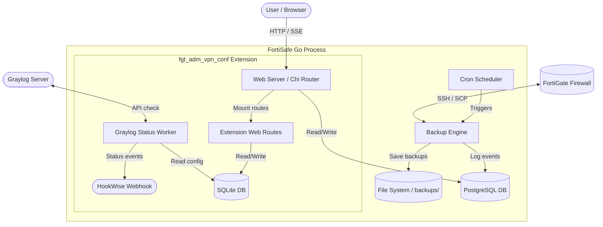

# FortiSafe

<p align="center">
  
</p>

<p align="center">
  <strong>Secure, scheduled, and self-contained backups for FortiGate firewalls, rewritten in Go.</strong>
</p>

<p align="center">
  <a href="https://golang.org"></a>
  <a href="https://github.com/arumes31/fortigate-scp-backup/actions/workflows/ci.yml"></a>
  <a href="https://github.com/arumes31/fortigate-scp-backup/pkgs/container/fortigate-scp-backup"></a>
  <a href="LICENSE"></a>
</p>

---

## 📖 Overview

**FortiSafe** is a web-based management tool and cron-based automation engine designed to back up FortiGate firewall configurations securely over SSH/SCP. 

Originally written in Python/Flask, FortiSafe has been fully rebuilt from the ground up in **Go**. It compiles into a **single, fully static, high-performance binary** that runs the web interface, the backup scheduler, and all extension background workers as concurrent goroutines in a single process.

### Why Go?
* **Single-Process Model**: No separate WSGI server (Gunicorn), celery workers, or background task runners. Everything runs in lightweight goroutines.
* **Fully Static & Lightweight**: Replaces Python dependencies with a distroless container containing only the compiled binary and root CA certificates.
* **No CGO Required**: Pure Go drivers (such as `modernc.org/sqlite` for extensions) ensure smooth compiling and cross-platform compatibility.
* **Drop-in Compatible**: Honors the exact same environment variables and data schemas as the original Python project, allowing seamless replacement.

---

## 🏗️ Process Architecture



---

## ✨ Features

- 🛡️ **Firewall Management**: Connect and monitor multiple firewalls using custom credentials, ports, and backup schedules.
- ⏰ **Automated Scheduling**: Set up cron or interval-based backups with automatic, staggered runs on startup to avoid traffic spikes.
- 🔐 **Hardened Security**:
  - **AES-256-GCM Encryption**: Optional encryption at rest for all backups and firewall SSH passwords.
  - **Session Guard**: Session signing, idle session timeouts, and IP pinning.
  - **Multi-Factor Auth**: Admin accounts support optional TOTP and RADIUS (PAP) authentication.
- 📡 **Real-time Updates**: Live status propagation via Server-Sent Events (SSE) direct to the UI.
- ✉️ **SMTP Alerts**: Automatic email notifications with STARTTLS enforcement when a backup fails.
- 🔌 **Modular Extension System**: Clean interface loader to mount self-contained extensions (e.g., FGT ADM VPN configuration module).

---

## 📋 Prerequisites

1. **FortiGate SSH & SCP Access**:
   Ensure SCP backups are enabled on the target FortiGate:
   ```txt
   config system global
       set admin-scp enable
   end
   ```
2. **SCP User Account & Profile**:
   Create a dedicated profile and administrator user with read/write access to system configs:
   ```txt
   config system accprofile
       edit "scp-profile"
           set comments "Access profile for FortiSafe backups"
           set secfabgrp read
           set ftviewgrp read
           set authgrp read
           set sysgrp custom
           set netgrp read
           set loggrp read
           set fwgrp read
           set vpngrp read
           set utmgrp read
           set wifi read
           set cli-diagnose enable
           set cli-get enable
           set cli-show enable
           set cli-exec enable
           set cli-config enable
           config sysgrp-permission
               set admin read-write
               set upd read
               set cfg read
               set mnt read
           end
       next
   end

   config system admin
       edit "scpuser"
           set accprofile "scp-profile"
           set password <YOUR_SECURE_PASSWORD>
       next
   end
   ```

---

## 🚀 Installation & Deployment

We provide two Docker Compose setups under the project root:

### 1. Build and Run Locally (Development / Custom Build)
Uses [`docker-compose.yml`](docker-compose.yml) to compile the static Go binary inside a multi-stage Docker build:
```bash
docker compose up -d
```

### 2. Run Pre-built Image from GHCR (Production)
Uses [`docker-compose.ghcr.yml`](docker-compose.ghcr.yml) to fetch the latest official package directly from GitHub Container Registry:
```bash
docker compose -f docker-compose.ghcr.yml up -d
```

> [!NOTE]
> By default, the application maps local `./backups` and `./data` directories for persistent storage.

---

## ⚙️ Configuration Reference

FortiSafe is configured entirely via environment variables.

### General Configuration
| Variable | Default Value | Description |
| :--- | :--- | :--- |
| `TZ` | `Europe/Vienna` | Timezone location used by the scheduler. |
| `PORT` | `8521` | HTTP port the application web server listens on. |
| `LOG_LEVEL` | `info` | Logging verbosity: `debug` \| `info` \| `warn` \| `error`. |
| `BACKUP_DIR` | `backups` | Storage directory for configuration backups. |
| `DATA_DIR` | `/app/data` | Storage directory for SQLite extensions data. |

### PostgreSQL Configuration (Main Database Store)
| Variable | Default Value | Description |
| :--- | :--- | :--- |
| `PG_HOST` | `localhost` | PostgreSQL host. |
| `PG_PORT` | `5432` | PostgreSQL port. |
| `PG_USER` | `your_user` | PostgreSQL user. |
| `PG_PASSWORD` | `your_password` | PostgreSQL password. |
| `PG_DATABASE` | `firewall_backups` | PostgreSQL database name. |
| `PGSSLMODE` | `prefer` | SSL connection mode. |
| `PG_MAX_CONNS` | `50` | Maximum connections allowed in the database pool. |
| `PG_CONNECT_RETRIES` | `10` | Database connection retry attempts on startup. |
| `PG_CONNECT_BACKOFF_SECONDS` | `3` | Time to wait between connection retry attempts. |

### Authentication & Web Security
| Variable | Default Value | Description |
| :--- | :--- | :--- |
| `TOTP_ENABLED` | `false` | Enable TOTP 2FA authentication for the local admin. |
| `TOTP_SECRET` | *(Auto-generated)* | 16-character Base32 TOTP secret. |
| `RADIUS_ENABLED` | `false` | Enable RADIUS fallback authentication. |
| `RADIUS_SERVER` | `localhost` | RADIUS server address. |
| `RADIUS_PORT` | `1812` | RADIUS service port. |
| `RADIUS_SECRET` | `secret` | RADIUS shared secret key. |
| `LOGIN_MAX_ATTEMPTS` | `5` | Maximum login failures allowed before lockout. |
| `LOGIN_LOCKOUT_MINUTES` | `15` | Minutes a user is locked out after limit exceeded. |
| `SESSION_KEY` | *(Auto-generated)* | Secure token signing key (forces re-login on restart if empty). |
| `COOKIE_SECURE` | `false` | Enable the `Secure` flag on session cookies (requires HTTPS). |
| `ENABLE_HSTS` | `false` | Emit `Strict-Transport-Security` headers (requires HTTPS). |
| `TRUST_PROXY_HEADERS` | `false` | Trust `X-Forwarded-For` header for client IP verification. |

### Backup Engine & SCP Defaults
| Variable | Default Value | Description |
| :--- | :--- | :--- |
| `ENCRYPTION_KEY` | *(Unset)* | 32-byte (hex/base64) key to enable AES-256-GCM encryption at rest. |
| `DEFAULT_SCP_USER` | `test` | Default SSH username when none is specified. |
| `DEFAULT_SCP_PASSWORD` | *(Unset)* | Default SSH password when none is specified. |
| `FORTIGATE_CONFIG_PATH` | `sys_config` | Remote file path to download (typically `sys_config`). |
| `SCP_TIMEOUT` | `60` | SSH connection and transfer timeout in seconds. |
| `MAX_CONCURRENT_BACKUPS` | `10` | Semaphore cap limiting simultaneous SSH sessions. |
| `CSV_MAX_BYTES` | `5242880` | Maximum allowed size (in bytes) for CSV bulk uploads. |

### SMTP Mail Notification Settings
| Variable | Default Value | Description |
| :--- | :--- | :--- |
| `MAIL_SERVER` | `smtp.example.com` | SMTP host for backup failure notifications. |
| `MAIL_PORT` | `587` | SMTP port (STARTTLS is enforced). |
| `MAIL_USER` | `user@example.com` | SMTP authentication user. |
| `MAIL_PASSWORD` | `password` | SMTP authentication password. |
| `MAIL_RECIPIENT` | *(Same as user)* | Destination email address for error logs. |

### Extension: FGT ADM VPN Configuration (`EXT_ADM_VPN_CONF`)
| Variable | Default Value | Description |
| :--- | :--- | :--- |
| `EXT_ADM_VPN_CONF` | `false` | Enable the FGT ADM VPN Config module. |
| `GRAYLOG_URL` | *(Unset)* | API endpoint for the Graylog cluster. |
| `GRAYLOG_TOKEN` | *(Unset)* | Graylog authentication token. |
| `GRAYLOG_SEARCH_TIMEFRAME` | `86400` | Device status log timeframe scan in seconds. |
| `HOOKWISE_URL` | *(Unset)* | Webhook endpoint for HookWise up/down transition logs. |
| `HOOKWISE_TOKEN` | *(Unset)* | Bearer authentication token for HookWise webhook. |
| `ACTIVITY_LOG_RETENTION_DAYS` | `0` | Auto-prune activity logs older than N days (0 = keep forever). |

---

## 🔌 Modules & Extensions

### FGT ADM VPN Config
This module provides customer-specific VPN configurations and device statuses.
* **Independent Storage**: Mounts an SQLite database (`fgt-adm-vpn-conf-db.db`) inside the data directory to manage entries locally without bloating Postgres.
* **Public Status DSV Endpoint**: `/fgt-adm-vpn-conf/graylog_dsv` serves raw, unauthenticated status data (`Firewallname;Remote_IP;Status`) for external metrics collectors.
* **Graylog Integration**: Checks Graylog API to assert status. A firewall is considered `online` if logs are found within the `GRAYLOG_SEARCH_TIMEFRAME` (default 24h).
* **HookWise Alerting**: Sends HTTP webhooks on transition states (`online` ↔ `offline`).

---

## 🛠️ Development & Building from Source

### Native Binary Compilation
Because the application leverages embedded statics and timezone data, CGO is disabled. You can build a native binary cleanly without a C toolchain:
```bash
CGO_ENABLED=0 go build -ldflags="-s -w" -o fortisafe ./cmd/fortisafe
./fortisafe
```

### Local Docker Build
```bash
docker build -t fortisafe:local .
```

### Run Tests and Code Quality
We enforce standard code formatting and linters via GitHub Actions:
```bash
# Run tests
go test ./...

# Run linters
golangci-lint run
```

---

## 🤝 Contributing

1. Fork this repository.
2. Create a clean feature branch: `git checkout -b feature/my-new-feature`.
3. Commit your changes with descriptive messages: `git commit -m 'feat: add support for X'`.
4. Push to your branch: `git push origin feature/my-new-feature`.
5. Open a Pull Request pointing to `main`.

---

## 📄 License

This project is licensed under the MIT License - see the [LICENSE](LICENSE) file for details.
